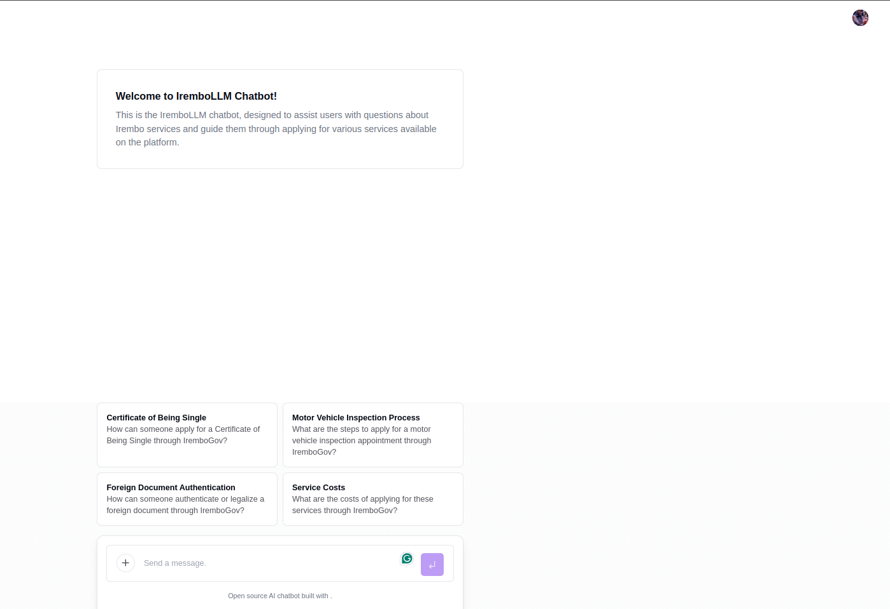

# Irembo LLM Chatbot

  

**Welcome to Irembo LLM, your virtual assistant for navigating and applying for Irembo services.**

**Description**

The Irembo LLM chatbot is designed to provide users with a seamless and efficient experience on the Irembo platform. It offers:

- **Information on Irembo Services**: Get details about various services, including foreign travel documents, motor vehicle inspections, and certificates of being single.
- **Step-by-Step Application Guidance**: The chatbot will walk you through the application process for any supported service, ensuring a smooth and error-free submission.
- **Direct Application**: Apply for Irembo services directly through our application, saving you time and effort.
- **FAQ Support**: Find answers to common questions about Irembo services and procedures.
- **Multilingual Support**: Communicate with the chatbot in English, French, or Kinyarwanda.

**Live URLs**

- [Main Application](https://diracmurairi.me)
- [Back Office](https://irembo-backoffice.vercel.app/)

**Demo**

- [Applying for a Foreign Travel Document](https://www.loom.com/share/7488d4e8672e45b38a3416690859c122?sid=a118fa54-79ef-4f0d-9112-2b0093cf99c1)
- [Checking the Status of an Application](https://www.loom.com/share/428f9899044948758ef0e1e735925e1a?sid=483dc24d-316f-4bf6-9e30-e4f322da9fd8)

**How to Run the Project**

1. **Prerequisites**:
   - Ensure you have Node.js (version 22 or higher) and npm (or yarn) installed on your system.
   - Ensure you have Python (version 3.12 or higher) installed on your system.
2. **Clone the Repository**: `git clone https://github.com/iremboLLM/application.git`
3. **Install Dependencies**:
   - `npm install`
4. **Set Up Environment Variables**:
   - **Backend:**
     - Create a `.env` file in the `backend` directory.
     - Use `.env.example` in the `backend` directory as a template.
     - Populate `.env` with the necessary API keys and configurations.
   - **Frontend:**
     - Create a `.env.local` file in the `frontend` directory.
     - Use `.env.example` in the `frontend` directory as a template.
     - Populate `.env.local` with the necessary API keys and configurations.
5. **Development Mode**:
   - `npm run build`
   - `npm run dev`
6. **Production Mode**:
   - `npm run build`
   - `npm run start`

**Contributors**

<table>
  <tbody>
    <tr>
      <td align="center" valign="top" width="14.28%"><a href="https://github.com/DAMILARE1012"> <b>Damilare</b></a> <a href="https://github.com/iremboLLM/application/commits?author=DAMILARE1012" title="Code">💻</a></td>
      <td align="center" valign="top" width="14.28%"><a href="https://github.com/Degrandlac"> <b>Harerimana Kevin</b></a> <a href="https://github.com/iremboLLM/application/commits?author=Degrandlac" title="Code">💻</a></td>
      <td align="center" valign="top" width="14.28%"><a href="https://github.com/Dirac156"> <b>Dirac Murairi</b></a> <a href="https://github.com/iremboLLM/application/commits?author=Dirac156" title="Code">💻</a></td>
      <td align="center" valign="top" width="14.28%"><a href="https://github.com/lgihozo"> <b>lgihozo</b></a> <a href="https://github.com/iremboLLM/application/commits?author=lgihozo" title="Code">💻</a></td>
    </tr>
  </tbody>
</table>
